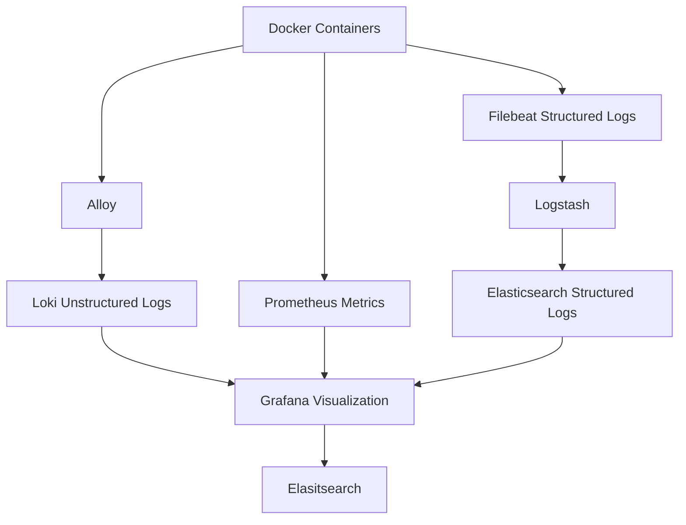

# 📈 Monitoring Stack with Prometheus, Grafana, Elasticsearch, Loki, Alloy, Logstash, and Filebeat

> **Quick Start:**  
> Clone the repository and run the full monitoring stack in one command:  
> 
> ```bash
> git clone <your-repo-url>
> cd <your-repo-folder>
> docker-compose up -d
> ```
> Access Grafana at [http://localhost:3000](http://localhost:3000) (user: `admin`, pass: `admin`).

---

## 📊 Architecture Overview



---

## 📦 Stack Components

| Service | Description |
|:--------|:------------|
| **Prometheus** | Scrapes and stores time series metrics. |
| **Grafana** | Dashboards and visualization for metrics and logs. |
| **Elasticsearch** | Stores structured logs for searching and analysis. |
| **Loki** | Stores unstructured logs (stdout/stderr) from containers. |
| **Alloy** | Scrapes Docker container logs and pushes to Loki. |
| **Logstash** | Processes and enriches logs received from Filebeat. |
| **Filebeat** | Ships logs from the host filesystem to Logstash. |

---

## 🛠 Project Structure

```bash
.
├── docker-compose.yml
├── volumes/
│   ├── prometheus/
│   │   └── prometheus.yml
│   ├── loki/
│   │   └── loki-config.yaml
│   ├── alloy/
│   │   └── config.alloy
│   ├── logstash/
│   │   └── logstash.conf
│   └── filebeat/
│       └── filebeat.yml
```

---

## ⚙️ Services Details

### Prometheus
- Collects metrics from running services.
- Configured via `./volumes/prometheus/prometheus.yml`.
- Accessible at [http://localhost:9090](http://localhost:9090).

### Grafana
- Provides visualization for both metrics and logs.
- Default login:  
  - **Username**: `admin`
  - **Password**: `admin`
- Accessible at [http://localhost:3000](http://localhost:3000).

### Elasticsearch
- Stores structured log data.
- Runs in single-node mode without security features for simplicity.
- Accessible at [http://localhost:9200](http://localhost:9200).

### Loki
- Collects unstructured logs (like stdout/stderr from containers).
- Configured via `./volumes/loki/loki-config.yaml`.
- Exposes API on [http://localhost:3100](http://localhost:3100).
- Mounts Docker container logs from `/var/lib/docker/containers/`.

### Alloy
- Scrapes logs from Docker containers.
- Configuration in `./volumes/alloy/config.alloy`.
- Pushes logs to Loki.

### Logstash
- Consumes logs from Filebeat.
- Processes/enriches data before sending to Elasticsearch.
- Configured via `./volumes/logstash/logstash.conf`.
- Listens on ports `5044` (Filebeat input) and `9600` (monitoring API).

### Filebeat
- Ships log files to Logstash.
- Configured via `./volumes/filebeat/filebeat.yml`.
- Reads from `/var/log` mapped to `logdata-storage`.

---

## 👤 Accessing the Services

| Service | URL |
|:--------|:----|
| Prometheus | [http://localhost:9090](http://localhost:9090) |
| Grafana | [http://localhost:3000](http://localhost:3000) |
| Elasticsearch | [http://localhost:9200](http://localhost:9200) |
| Loki | [http://localhost:3100](http://localhost:3100) |

---

## 📂 Volumes

| Volume | Purpose |
|:-------|:--------|
| `grafana-storage` | Persistent storage for Grafana dashboards and settings. |
| `esdata` | Persistent storage for Elasticsearch indices. |
| `logdata-storage` | Shared log directory for Alloy and Filebeat. |
| `loki-data` | Persistent storage for Loki WAL, chunks, and index files. |

---

## 🛠 How to Run

1. Make sure you have **Docker** and **Docker Compose** installed.
2. Clone the repository or place the files accordingly.
3. Run the stack:

```bash
docker-compose up -d
```

4. Check that all services are healthy:

```bash
docker ps
```

---

## 🔥 Important Notes

- Docker container logs are scraped from `/var/lib/docker/containers/*.log`.
- Promtail is replaced by Alloy for direct Docker container scraping.
- Filebeat collects logs from `/var/log`, which is shared across containers via `logdata-storage`.
- No authentication/security is enabled by default (for local use). For production, secure Grafana, Elasticsearch, and Logstash.

---

## Docker compose versus Kubernetes
Docker compose is the easiest way to develop. But in production Kubernetes is the standard environment.
Docker compose writes logs to /var/lib/docker/containers/*.log. Kubernetes writes logs to /var/log/pods/ and /var/log/containers/

---

## 📌 Future Improvements

- Add authentication for Elasticsearch and Grafana.
- Implement SSL/TLS encryption.
- Configure alerting rules in Prometheus and Grafana.
- Add Retention Policies for Loki and Elasticsearch.

---

## 📋 License

This project is open source and available under the [Apache License 2](LICENSE).
